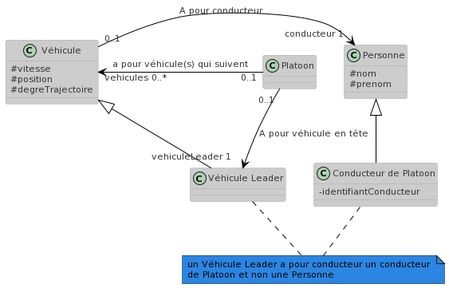
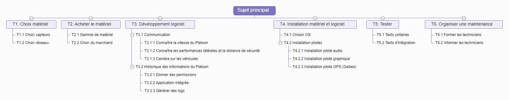

# Cahier des charges fonctionnel - Platoon de véhicules

## 1. Présentation générale du problème

L’entreprise ElectroIUT souhaite produire des véhicules qui peuvent rouler en formation semblable aux wagons d'un train
se suivant les uns les autres.
Dans les approches globales, un des vehicule du platooning
(genéralement le véhicule de tête) envoi les informations
nécessaires (instructions d’accélération et de décélération,
points de la trajectoire...) aux véhicules suivants. Ces véhicules font l'usage de certains systèmes comme le GPS RTK (Real Time Kinematic) ou le GPS GPRS (GPS Portable) afin de calculer les points de trajetoire pour les vehicules suiveurs.
Les approches globales permettent un bon suivi de trajectoire. Néanmoins l’utilisation des GPS ou autres technologies
nécessitent l’adaptation des routes dans le but d'éviter la perte du signal GPS (entre autres les tunnels et canyons). 

### 1.1 Projet

#### 1.1.1 Finalités

La finalité de ce projet est d'abord un avantage sociétal étant donné que les usagers peuvent se déplacer en communauté. Cette stratégie de mouvements coordonnées aborde les problèmes de transport tels que la congestion routière, la pollution, la consommation d'énergie et la sécurité routière. 
L'utilisation de ce système par les usagers permettrait de réduire le nombre d'accident sur les routes. Il convient de noter également une réduction des émissions de CO2 et de la surconsommation de carburant.

#### 1.1.2 Espérance de retour sur investissement

Selon la recherche "Trends in fatal car accidents: analyses of CCIS data" (https://trid.trb.org/view/804459) il est estimé que 18% des accidents de la route proviennent de l'inatention du conducteur. De plus, selon "The Aerodynamic Performance of Platoons - A Final Report" de la collaboration PATH (Partners for Advanced Transit and Highways) admet une réduction de 20% en moyenne d'essence sur voie rapide avec le système de Platoon. 

La baisse de la consommation d'énergie et le gain de sécurité ammenés par ce système permettent de conjecturer un retour sur investissement positif. Le coût du dispositif et de la recherche s'avérant élevé, il n'est pas envisageable d'estimer un retour sur investissement plus haut que 5% les premiers mois de sa commercialisation. Il est espérable de dépasser ce seuil en moins de 2 ans ; dans le cas contraire le projet serait considéré comme un échec.

Cet investissement dépasse également le domaine de l'automobile et trouverait sa place dans le tourisme (train de véhicules en ville) ou encore l'aéronavale dans la gestion d'une flottille. 

### 1.2 Contexte

#### 1.2.1 Situation du projet par rapport aux autres projets de l’entreprise
Plusieurs projets d’étudiants au département ont travaillé sur un platoon de véhicule Lego. Nous avons aussi publié plusieurs travaux de recherche sur la vérification de leur comportement. Cependant celle-ci est minime étant donné qu'il n'y a pas eu d'étude grandeur nature de cette technologie.
De plus, les entreprises nécessitent un budget conséquent à la réalisation de ces projets.

#### 1.2.2 Études déjà effectuées

Beaucoup d'études ont déjà été effectuées en simulant le comportement des véhicules suiveurs selon un modèle respectant les lois
de la physique.
Ce comportement est le resultat d’une composition cyclique des 3 sous-comportements : 
- Perception : Mesure la distance entre deux vehicules qui se suivent.
- Contrôle : Calcule l’accelération du système
- Modèle Physique : Calcule la réaction en fonction de la vitesse.
Des informations complémentaires sont disponibles sur le lien ci-dessous d'une étude de chercheurs du laboratoire Système et Transport
de L'université de Technologie de Belfort-Montbéliard.

Source : [Convoi de véhicule pour une nouvelle forme de mobilité](http://citeseerx.ist.psu.edu/viewdoc/download?doi=10.1.1.726.8825&rep=rep1&type=pdf)

#### 1.2.3 Études menées sur des sujets voisins

Le sujet de Platoon de véhicules a déjà fait l'objet d'études. Il convient de citer Cycabs et du projet MobiVip (Véhicules individuels publics pour la mobilité en centre-ville) les expérimentant. Les Cycabs se présentent comme des voitures urbaines dotées des technologies GPS, WiFi et des capteurs visuels leur permettant de se déplacer sans intervention humaine. Leur architecture se compose de la couche physique (la vitesse et direction de la voiture), la couche commande (pc embarqué) ainsi que la couche coordination (GPS, caméras, communication entre plusieurs véhicules). Plusieurs expériences ont pu être menées sur le campus des "Cézeaux" sur Clermont-Ferrand et valider les performances de ces voitures.  

Il convient de citer également le SARTRE Platooning Programme dirigé par Volvo et financé par la Commission Européenne. Les deux démonstrations en Janvier 2011 et Janvier 2012 se montrent réussis avec un camion en tête et 3 voitures espacées de moins de 6m allant jusqu'à 90 km/h.

#### 1.2.4 Suites prévues

Le projet est un prototype de logiciel fonctionnant avec des robots en LEGO. Il pourra ensuite être utilisé et vendu à des clients tels que des constructeurs automobiles, avec quelques modifications en fonction de la demande et des outils utilisés.

#### 1.2.5 Nature des prestations demandées

- Etude et conception du logiciel
- Développement du logiciel
- Formation au commandes du véhicule en tête du platoon
- maintenance informatique (révision du système)

#### 1.2.6 Parties concernées par le déroulement du projet et ses résultats (demandeurs, utilisateurs)

Tout d'abord, le projet est lancé à la demande de l'entreprise ElectroIUT, le commanditaire et responsable du projet. 

Ensuite, les utilisateurs (futurs usagers, particuliers ou professionnels) sont directement concernés par les livrables (Platoon de véhicules). Les actionnaires attendent un résultat qui valorise leur patrimoine sans être nécesssairement des utilisateurs. 

Enfin, L'équipe de projet (développeurs, testeurs, chef de projet) entreprennent le développement du logiciel, participent au déroulement du projet directement aux résultats cités dans le cahier des charges. La direction de l'entreprise ElectroIUT est également concernée par le déroulement du projet. 

#### 1.2.7 Caractère confidentiel s'il y a lieu

La collecte des données par l'intermédiaire des capteurs visuels, du GPS et autres technologies présentes ne doivent en aucun cas aller à l'encontre des lois relatives aux données personnelles, notamment le RGPD. 

Les données des véhicules concernant la position, la vitesse, le freinage et autres informations à transmettre aux véhicules doivent transiter de manière sécurisé uniquement dans le platoon. Il est envisageable de communiquer les informations sur les performances latérales (trajectoire des véhicules) et distances de sécurité sous réserve d'avoir l'accord des usagers.

Les capteurs visuels ont pour contrainte d'être placés tournés vers le sol afin de ne pas filmer par exemple les fenêtres d'un immeuble et garantir la protection de la vie privée lorsque les véhicules circulent sur la voie publique. La durée de conservation de ces images doit correspondre à l'objectif du platoon et leur usage. Après traitement, il n'est pas nécessaire de garder les images collectées par les capteurs visuels. 

### 1.3 Énoncé du besoin

Schéma du besoin(diagramme Bête à corne) :

Le Platoon de véhicules rendra service aux clients usagers de ce système. Celui-ci leur permettra de rouler en plus grande sécurité, consommer moins d'énergie (type d'énergie en fonction du modèle de véhicule) ainsi que de réduire la congestion routière en fluidifiant le trafic. 

### 1.4 Environnement du produit recherché

#### 1.4.1 Listes exhaustives des éléments *(personnes, équipements, matières…)* et contraintes *(e.g. environnement)*

Une équipe de trois personnes sera nécéssaire.

Liste des équipements du projet:
- Des locaux
- Des Pc pour programmer et faire office de télécommande pour le train de véhicules (3 PC minimum)
- plusieurs robots en LEGO du platoon afin de tester le bon fonctionnement du logiciel
- des piles

Les contraintes sont:
- Des locaux assez grands pour pouvoir faire fonctionner le platoon sur différents circuits
- faire attentions au fréquences utilisées pour ne pas avoir d'interférences avec d'autres matériels

#### 1.4.2 Caractéristiques pour chaque élément de l’environnement

- La pièce de travail pourra aussi servir aux tests du platoon. Elle devra dans ce cas mesurer au moins mesurer 10 m × 5m pour avoir des trajectoires différentes pour dans les cas de tests. Il est nécessaire d'avoir la possibilité d'y installer un bureau dans l'objectif de programmer dans celui-ci.
- Le pc pour la programmation aura un processeur aura un processeur Intel I7 ainsi que 16 GigaOctets de RAM pour pouvoir faire du calcul sans difficultés. La connexion sera faite par des cartes wifi 6 installées sur chaque véhicule.
- Des boîtes de LEGO Eduction Spike Principal + pièces de LEGO spécifiques tel que le moteur de train, le capteur de couleur et de distance et un boîters à pile de la collection LEGO power-up (une alternative serait un ou des kits LEGO Robot Inventor).
- Des batteries de qualité industrielle car les essais seront nombreux et pourront durer un certains temps.

## 2. Expression fonctionnelle du besoin

__Diagramme de cas d’utilisation__ :

Cas d'utilisation n°1 : Maintenance.  
Responsabilité : création et maintenance du logiciel de gestion des platoons.  
Acteur(s) : Création du projet, mise à jour du fonctionnement/comportement des véhicules.  
Déclencheurs : Début du projet. Imperfections des comportements du platoon ou des véhicules. Panne d'un véhicule.  
Pré-conditions : bug du système de communication entre les véhicules. Problèmes de capteur des véhicules. Réparation mécanique des véhicules.  
Post-conditions : système de communication entre les véhicules fonctionnel. Capteurs réparés. Véhicules en état de fonctionnement.  
Invariant : Platoon en fonctionnement.  
Scénario nominal : Le platoon peut repartir. Le fonctionnement de celui-ci est mis à jour et amélioré.  
Scénario exceptionnel : Le platoon ne peut repartir à cause d'un dysfonctionnement difficile à débugger.

cas d'utilisation n°2 : Intégrer le platoon.  
Responsabilité : Le véhicule intègre le platoon.  
Acteur(s) : Utilisateur (Acteur Déclencheur), Véhicule (Acteur Impliqué)  
Déclencheurs : Choix de l'utilisateur d'intégrer le platoon.  
Pré-conditions : Le véhicule est à l'extérieur du platoon et circule. Le platoon circule.  
Post-conditions : Le véhicule a intégré le platoon.  
Invariant : le véhicule est déjà intégré à un platoon  
Scénario nominal : Le platoon intègre et continue avec le nouveau véhicule.  
Scénarion exceptionnel : Le véhicule n'est pas intégré au platoon.  

Cas d'utilisation n°3 : Quitter le platoon.  
Responsabilité : Le véhicule quitte le platoon.  
Acteur(s) : Utilisateur (Acteur Déclencheur), Vehicule (Acteur Impliqué)  
Déclencheurs : L'utilisateur demande à quitter le platoon  
Pré-conditions : Le véhicule est à l'intérieur du platoon et circule. Le platoon circule.  
Post-conditions : Le véhicule a quitté le platoon.  
Invariant : le véhicule n'est pas intégré à un platoon  
Scénario nominal : Le véhicule quitte le platoon  
Scénario exceptionnel : Le véhicule n'arrive pas a intégrer un platoon.  

cas d'utilisation n°4 : Consulter l'historique.  
Responsabilité : Consulter l'historique des véhicules (les données générées pendant l'utilisation).  
Acteur(s) : Développeurs (acteurs déclencheurs), véhicules (acteurs impliqués).  
Déclencheurs : Le développeur souhaite consulter l'historique.  
Pré-conditions : véhicule à l'arrêt.  
Post-conditions : véhicule à l'arrêt, développeur a pu obtenir les données disponibles.  
Invariant : Le développeur visionne et/ou récupère les données d'un véhicule en marche.  
Scénario nominal : le développeur visionne et/ou récupère d'un véhicule à l'arrêt.  
Scénario exceptionnel : le véhicule n'a pas de données de disponible.  

Cas d'utilisation n°5 : Communication entre les véhicules.  
Responsabilité : Les véhicules communique entre eux par le biais par le réseau du platoon.  
Acteur(s) : Le platoon fonctionne et les véhicules communiquent entre eux en continue pour s'envoyer les informations nécessaires au bon fonctionnement. L'intégration d'un véhicule nécessite la communication du véhicule avec le platoon.  
Déclencheurs : Choix de l'utilisateur d'intégrer le véhicule.Fonctionnement du platoon.  
Pré-conditions : Platoon et véhicules en circulation. Tous les capteurs et le système de communication en état.  
Post-conditions : Communication réussie entre les différents véhicules.  
Invariant : Communication défecteuse du sytème global ou d'un véhicule.  
Scénario nominal : Les véhicules communiquent leurs données pour adapter leur conduite convenablement.  

Cas d'utilisation n°6 : Vitesse.  
Responsabilité : Augmenter ou réduire la vitesse du véhicule.  
Acteur(s) : Véhicule maître (acteur déclencheur), véhicules (acteurs impliqués).   
Déclencheurs : Le véhicule maître communique aux autres véhicules la vitesse calculée afin qu'ils l'applique.  
Pré-conditions : véhicules dans le platoon, communication entre les véhicules réussie.  
Post-conditions : les véhicules accélèrent ou ralentissent suivant la vitesse communiquée.  
Invariant : Le développeur visionne et/ou récupère les données d'un véhicule en marche.  
Scénario nominal : le développeur visionne et/ou récupère d'un véhicule à l'arrêt.  
Scénario exceptionnel : le véhicule n'a pas de données de disponible.  

Cas d'utilisation n°7 : Trajectoire entre les véhicules.  
Responsabilité : Les véhicules calculent leur tajectoire par le biais de leur capteur et des données envoyées au logiciel par ceux-ci.  
Acteur(s) : Le véhicule maître calcul la trajectoire (acteur déclenchant) et l'envoie aux autres véhicules du platoon ou aux véhicules entrant dans le platoon (acteurs impliqués).   
Déclencheurs : changement de tajectoire et calcul en temps réel du véhicule maître.  
Pré-conditions : Le platoon circule. Le système de communication ainsi que les capteurs fonctionnent.  
Post-conditions : Changement de trajectoire des différents véhicules du platoon.  
Invariant : Communication défecteuse entre les véhicules.  
Scénario nominal : Les différents véhiculent du platoon suivent la trajectoire du véhicule maître.  

Cas d'utilisation n°8 : Prise de décision sur le comportement du platoon.  
Responsabilité : Le véhicule maître prends les décisions (en utilisant le logiciel) en fonction des donnés reçues, le platoon réagira ensuite.  
Acteur(s) : Le véhicule maître (acteur déclenchant), autres véhicules du platoon (acteurs impliqués).   
Déclencheurs : changements dans l'environnement (objets ou voitures sur la trajectoire, ralentissement du trafic...).  
Pré-conditions : Le platoon circule. Le système de communication ainsi que les capteurs fonctionnent.  
Post-conditions : Une décision est prise par le véhicule maître est envoyée aux autres véhicules pour qu'il agissent en fonction.  
Invariant : Communication défecteuse entre les véhicules. Véhicule maître hors-service.   
Scénario nominal : Le véhicule du platoon agissent en fonction de la décision du véhicule maître.  

### 2.1 Fonctions de service et de contrainte

#### 2.1.1 Fonctions de service principales

 - FP1 : Communication entre les véhicules
 - FP2 : Prise de décisions sur le comportement du platoon

##### 2.1.1.1 Description et détail

- FP1 : Les véhicules communiquent au véhicule maître par ondes (wifi 6E) leurs données respectives. Celui-ci renvoie les décisions prises à partir de ces données. Des récepteurs avec antennes sont implantés sur chaque véhicule.  
- FP2 : La prise de décision peut être prise par l'utilisateur dans un cas de freinage ou de changement de direction, qui envoie l'information au véhicule maître. Dans un deuxième cas la prise de décision peut être est faite par l'ordinateur en cas de rencontre d'obstacles sur le chemin par exemple (reconnus grâce aux capteurs présents sur le véhicule maître).  

##### 2.1.1.2 Critères d’appréciation et les niveaux qui les caractérisent

- FP1 : Communication entre les véhicules  
Contrainte 1A : Le temps d'envoi des données doit être très rapide pour une prise de décision immédiate.  
niveau d'appréciation : 5 millisecondes  
Niveau de fléxibilité : +/- 1 milliseconde  
- FP2 : Prise de décision sur le comportement du platoon  
Contrainte 2A : Temps nécessaire à la prise de décision.   
niveau d'appréciation : 10 millisecondes  
Niveau de fléxibilité : +/- 2 millisecondes  

#### 2.1.2 Fonctions de service complémentaires

- FC1 : Entretenir les véhicules  
Contrainte 3A : Pouvoir consulter l'historique de la gestion du véhicule et diagnostiquer une panne  
niveau d'appréciation : 1 entretien mécanique par an
Niveau de fléxibilité : +/- 3 mois
- FC2 : Pouvoir avancer avec une trajectoire précise 
Contrainte 4A : Choisir une vitesse  
niveau d'appréciation : avec un appui maximal du bouton d'accélération la vitesse du véhicule est au maximum.  
niveau de fléxibilité : +/- 5 % de différence de vitesse  
Contrainte 4B : Choix de trajectoire  
niveau d'appréciation : L'angle du joystick correspond à la trajectoire.  
niveau de fléxibilité : +/- 5 % de l'angle  
- FC3 : Alimentation énergétique  
Contrainte 5A : Source de l'énergie électrique  
niveau d'appréciation : Secteur EDF    
Contrainte 5B : Tension de l'alimentation  
niveau d'appréciation : 230 V   
Contrainte 5C : Energie rechargeable   
niveau d'appréciation : Technologie de batterie lithium ou NiMh(mAh)  

##### 2.1.2.1 Description et détail

- FC1 : l'entretien des véhicules est fait par l'utilisateur (qui est aussi le développeur dans notre cas). Il pourra consulter l'historique qui sera sauvegardé informatiquement en cas de pannes/bug complexe et difficile à trouver. Des pièces de remplacement seront en stock.  
- FC2 : la vitesse du véhicule sera proportionnelle à la force exercée sur le joystick (implémenté dans le logiciel). la trajectoire sera égale à l'angle donné au joystick par l'utilisateur.  
- FC3 : L'énergie utilisé sera électrique. On utilisera des batteries Lithium de 3800 mAh pour chaque véhicule (autonomie de 2 h 45 environ). Elle seront rechargées sur le secteur. Les ordinateurs utiliseront aussi le secteur.  

##### 2.1.2.2 Critères d’appréciation et les niveaux qui les caractérisent

- FC1 : Entretenir les véhicules  
Contrainte 3A : Pouvoir consulter l'historique de la gestion du véhicule et diagnostiquer une panne  
niveau d'appréciation : 1 entretien mécanique par an
Niveau de flexibilité : +/- 3 mois
- FC2 : Pouvoir avancer avec une trajectoire précise 
Contrainte 4A : Choisir une vitesse  
niveau d'appréciation : avec un appui maximal du bouton d'accélération la vitesse du véhicule est au maximum.  
niveau de flexibilité : +/- 5 % de différence de vitesse  
Contrainte 4B : Choix de trajectoire  
niveau d'appréciation : L'angle du joystick correspond à la trajectoire.  
niveau de flexibilité : +/- 5 % de l'angle  
- FC3 : Alimentation énergétique  
Contrainte 5A : Source de l'Energie électrique  
niveau d'appréciation : Secteur EDF    
Contrainte 5B : Tension de l'alimentation  
niveau d'appréciation : 230 V   
Contrainte 5C : Energie rechargeable   
niveau d'appréciation : Technologie de batterie lithium ou NiMh(mAh)  

#### 2.1.3 Contraintes

- FP1 : Les cartes wifi 6 des véhicules en état de fonctionnement. Le logiciel qui gère la communication entre les cartes est bien programmé.
Les batteries doivent être chargées.
- FP2 : Les capteurs de tous les véhicules fonctionnent normalement car ce sont eux qui envoient les données utilisées aux décisions prises.
Les batteries doivent être chargées.
- FC1 : Des pièces de rechange doivent être en stock en cas de pannes. Les batteries de remplacement doivent être chargées en permanence, en cas de niveau faible des batteries des véhicules. L'historique des véhicules doit être accessible facilement pour un utilisateur qui n'est pas développeur. Les utilisateurs qui ne sont pas développeur devront être formés.
- FC2 : Les niveaux de précision de vitesse et de trajectoire doivent rester constant (fonction de contrôle de précision dans le logiciel). Le joystick doit être de bonne qualité pour avoir une certaine précision (manette de PS3).
- FC3 : La batterie doit avoir une autonomie suffisante. Notre choix s'est tourné vers une batterie Lithium de 3800 MhA pour une autonomie estimée à 2h45. Des batteries de remplacement sont prévues pour pouvoir faire des tests sur de longues durées. 

## 3. Cadre de réponse

__Diagramme de classes métiers__ : 

__Tables synthétiques des jalons__ :

__Working Breakdown Structure__ :

### 3.1 Communication entre les véhicules

#### 3.1.1 Solution proposée 

__scénarios__ : Les véhicules communiquent entre eux les informations sur leur état comme la vitesse, le degré de trajectoire ou la distance entre le véhicule positionné devant eux. 

__Jalon__ : 6 Juillet 2022 - Fin d'installation des matériaux & logiciel

#### 3.1.2 Niveau atteint pour chaque critère d’appréciation de cette fonction et modalités de contrôle

Le Wi-Fi 6E mis en service en décembre 2021 permet de communiquer dans un environnement dense tout en profitant d'un débit élevé et d'une grande facilité à gérer les multiples connexions. Le temps d'envoi des données est ainsi inférieur à 5ms. 

#### 3.1.3 Part du prix

Nous partons du principe que les développeurs travailleront ensemble sur la création de chaque étape du projet et ne se diviseront pas pour tenter de réaliser le projet plus rapidement. Les équipements du projet ne sont pas intégrés à la part du prix et toutes les fonctions sont idépendantes les unes des autres.

Salaire à payer(1 mois et 6 jours) :
Développeur 1 : 3924€, Développeur 2 : 2636€, Développeur 3 : 2811.56€ 

Composant du platoon :
Prix : 533.54€
Prix total(en %) : 9805.1€(=30.08% du prix total)
### 3.2 Prise de décision sur le comportement du platoon

#### 3.2.1 Solution proposée 

__scénarios__ : Le véhicule en tête prend les décisions pour l'ensemble du Platoon avant de les communiquer. Lorsque le véhicule en tête détecte que la trajectoire doit être rectifiée et que les distances de sécurité doivent être réévaluées, il calcule la vitesse à appliquer pour chaque véhicule du Platoon et la trajectoire correcte à prendre avant de communiquer ces informations-là. 

__Jalon__ : 5 Juillet 2022 - Fin du développement logiciel 

#### 3.2.2 Niveau atteint pour chaque critère d’appréciation de cette fonction et modalités de contrôle

L'algorithme de prise de décision de la part du véhicule en tête du Platoon se doit d'être rapide et performant. Le matériel informatique que contient ce véhicule possède une puissance de calcul assez élevée pour calculer les décisions en moins de 12ms.

#### 3.2.3 Part du prix
Salaire à payer(1 mois et 5 jours) :
Développeur 1 : 3570€, Développeur 2 : ~2438€, Développeur 3 : ~2949.33€ 

Composant du platoon :
Prix : 533.54€
Prix total(en %) : 9490.87€(=29.29% du prix total)

### 3.3 Entretenir les véhicules

#### 3.3.1 Solution proposée 

__scénarios__ : La maintenance des véhicules se fait par le développeur en cas de panne ou bien en prévention. 

__Jalon__ : 3 Octobre 2022 - Fin de la formation des techniciens 

#### 3.3.2 Niveau atteint pour chaque critère d’appréciation de cette fonction et modalités de contrôle

La robustesse du logiciel et les tests unitaires, d'intégration et fonctionnels (end-to-end) garantissent un délai de 9 à 15 mois entre deux entretiens mécaniques. Les données de l'historique du véhicule sont conservées et récupérable lors de l'entretien technique. 

#### 3.3.3 Part du prix

Salaire à payer(Entre le 7 août au 3 octobre -> 2 mois et 25 jours) :
Développeur 1 : 8517€, Développeur 2 : 5692.17€, Développeur 3 : 5816.52€ 

Composant du platoon :
Prix : 533.54€
Prix total(en %) : 20559.23€(=57.73% du prix total)

### 3.4 Pouvoir avancer avancer avec une trajectoire précise

#### 3.4.1 Solution proposée

__scénarios__ : Lors d'un trajet le véhicule doit savoir maintenir une vitesse et une trajectoire idéale que le conducteur souhaite.
Cependant, le véhicule ne peut pas avancer avec une trajectoire trop différente de celle demandée notamment lors des virages.

__Jalon__ : 7 Août 2022 - Fin d'installation des matériaux

#### 3.4.2 Niveau atteint pour chaque critère d’appréciation de cette fonction et modalités de contrôle

#### 3.4.3 Part du prix
Salaire à payer(Entre le 29 Mai au 7 Août -> 2 mois et 10 jours) :
Développeur 1 : 7140€, Développeur 2 : 4876.67€, Développeur 3 : 5898.67€ 

Composant du platoon :
Prix : 533.54€
Prix total(en %) : 18448.88€(=55.55% du prix total)

### 3.5 Doit s'alimenter en énergie

#### 3.5.1 Solution proposée

__scénarios__ : Lors d'un trajet, un platoon et en général le véhicule doit constamment utilisé de l'énergie électrique.
Etant en mouvement cela est impossible de le brancher à une prise électrique mais elle peut disposer d'une batterie avec une certaine autonomie.

__Jalon__ : 6 Juillet 2022 - Fin d'installation des matériaux

#### 3.5.2 Niveau atteint pour chaque critère d’appréciation de cette fonction et modalités de contrôle

#### 3.5.3 Part du prix
Salaire à payer(1 mois et 6 jours) :
Développeur 1 : 3924€, Développeur 2 : 2636€, Développeur 3 : 2811.56€ 

Composant du platoon :
Prix : 533.54€
Prix total(en %) : 9905.10€(=30.08% du prix total)

### 3.6 Pour l’ensemble du produit

#### 3.6.1 Prix de la réalisation de la version de base

Sources :
- [__Raspberry Pi 4__](https://fr.rs-online.com/web/p/raspberry-pi/1822098)

- [__Raspberry Pi 3__](https://fr.rs-online.com/web/p/raspberry-pi/1720555)

- [__Manette__](https://www.gotronic.fr/art-manette-avec-recepteur-sans-fil-dg015-25181.htm#complte_desc)

- [__Carte wifi__](https://www.amazon.com/WISE-TIGER-AX210NGW-Wireless-Tri-Band/dp/B08NSSJNV1?dchild=1&keywords=ax210&qid=1619453774&sr=8-3&linkCode=sl1&tag=mmjjg-20&linkId=9ff64723832786e608cfaf01da3cc727&language=en_US&ref_=as_li_ss_tl)

- [__Capteur visuel__](https://www.kubii.fr/cameras-capteurs/1653-module-camera-v2-8mp-kubii-652508442112.html)

- [__Capteur de distance__](https://www.gotronic.fr/art-module-a-detection-us-hc-sr04a-27740.htm)

- [__Batterie__](https://www.amazon.fr/azdelivery-Batterie-portable-Power-Raspberry/dp/B072QZXTGS/ref=sr_1_2_sspa?keywords=batterie%2Braspberry&qid=1654103228&sr=8-2-spons&smid=A1X7QLRQH87QA3&spLa=ZW5jcnlwdGVkUXVhbGlmaWVyPUEyNkVYUU9WODJYT0JRJmVuY3J5cHRlZElkPUEwNTkzODMwS0JDSkIwUkM2NTVFJmVuY3J5cHRlZEFkSWQ9QTA0OTYzODYzVkdGT1FEWUxXTDROJndpZGdldE5hbWU9c3BfYXRmJmFjdGlvbj1jbGlja1JlZGlyZWN0JmRvTm90TG9nQ2xpY2s9dHJ1ZQ&th=1)

- [__DELL Inspiron 15__](https://www.dell.com/fr-fr/shop/ordinateurs-portables/inspiron-15/spd/inspiron-15-5515-laptop/cn51210sc11)

- [__TECHNIC - Véhicule transformable télécommandé__](https://www.lego.com/fr-fr/product/app-controlled-transformation-vehicle-42140)

- [__LEDs__](https://www.amazon.fr/azdeliver-KY-016-fz0455-couleurs-Arduino-KY-016-RGB/dp/B07CN499XS/ref=sr_1_4_sspa?keywords=Rgb%2BLed%2BArduino&qid=1654187924&sr=8-4-spons&smid=A1X7QLRQH87QA3&spLa=ZW5jcnlwdGVkUXVhbGlmaWVyPUEyMkdWVFNEMEJWR1gzJmVuY3J5cHRlZElkPUEwNjQ4ODQwM1cwR1pSRlczOEZITSZlbmNyeXB0ZWRBZElkPUExMDE0NTM1MVZOTUE2N1M4QUhCUSZ3aWRnZXROYW1lPXNwX2F0ZiZhY3Rpb249Y2xpY2tSZWRpcmVjdCZkb05vdExvZ0NsaWNrPXRydWU&th=1)

- [__Haut Parleurs__](https://www.kubii.fr/haut-parleurs-microphones/1850-mini-haut-parleurs-usb-kubii-6945379550159.html)

#### 3.6.2 Options et variantes proposées non retenues au cahier des charges

- [__Udoo Volt V8__](https://shop.udoo.org/en/udoo-bolt-v8.html) : Super-ordinateur portable beaucoup plus puissant que le Raspberry PI néanmoins 7 fois plus cher et en rupture de stock sur le site marchand.

- [__Carte d'extension WiFi__](https://fr.aliexpress.com/item/1005002483187367.html): Modèle pour Raspberry PI 4 plus cher que la carte d'extension Wifi 6E retenue

- [__Manette Xbox 360__](https://www.amazon.fr/Manette-sans-Adaptateur-Recepteur-Windows/dp/B088K8NNKN/ref=sr_1_1_sspa?keywords=manette+xbox+360&qid=1654158872&sr=8-1-spons&psc=1&spLa=ZW5jcnlwdGVkUXVhbGlmaWVyPUEzQUJKS09IQ1o3WEY3JmVuY3J5cHRlZElkPUEwMDg4NjY0MkJaUEU0WDVCMjBZTyZlbmNyeXB0ZWRBZElkPUEwNjY5MzY2M09WWUpFSFhUSFVFQiZ3aWRnZXROYW1lPXNwX2F0ZiZhY3Rpb249Y2xpY2tSZWRpcmVjdCZkb05vdExvZ0NsaWNrPXRydWU=) : Manette plus chère que celle retenue, récepteur prend plus d'espace.
- __Wifi 5Ghz intégré__ : Elle n'a pas été choisie car elle est émet trop de chaleur sur le Raspberry PI 4.

#### 3.6.3 Mesures prises pour respecter les contraintes et leurs conséquences économiques

Les véhicules esclaves sont dotés d'un nano-ordinateur monocarte moins puissant que celui du véhicule maître. De ce fait, les données sont traitées en grande partie par le véhicule maître tout en donnant à l'ensemble du platoon la possibilité de communiquer entre eux. Le prix de la réalisation est réduit car le prix du Raspberry PI 3 utilisé dans les véhicules esclaves est inférieur à celui du Raspberry PI 4 et permet d'économiser au minimum 40€ par véhicule. 

#### 3.6.4 Outils d’installation, de maintenance … à prévoir

- IDE Python 3.7 sur les PCs de travail
- Python 3.7 installé sur les Raspberry PI 4(voiture maître) et 3(voitures esclaves)
- Un tournevis
- Un Voltmètre
- [Un simulateur](https://docs.microsoft.com/en-us/azure/iot-hub/iot-hub-raspberry-pi-web-simulator-get-started)
-  Des composants électroniques de rechange

#### 3.6.5 Décomposition en modules, sous-ensembles

#### 3.6.7 Perspectives d’évolution technologique

Nous avons décidé de choisir des technologiques récentes(Wifi 6E) qui coûtent cher mais dans le futur les prix vont diminuer de manière évidante car celle-ci sera devenu courante dans la vie d'une personne mais aussi que d'autres technologies les remplaceront.

Cependant, nous prévoyons d'améliorer le système de communication en utilisant des capteurs de distance et visuels de meilleure qualité tout en restant sur un prix d'achat semblable voire inférieur.

## 4 Prévisions de fiabilité – Gestions des risques

### 4.1 Risques à la réalisation

__Profils de risques__ :

### 4.2 Prévision des défaillances

Lorsque le programme "bugge" ou plante, la prise de décision ne peut plus être effectuée : le Platoon n'a plus de cerveau pour prendre des décisions et peut provoquer un accident. C'est pour cela que la conception de tests unitaires et d'intégration jouent un rôle important dans le développement du logiciel. 

Le Platoon peut avoir un accident suite à différentes défaillances : le programme plante, des problèmes de batterie, le calcul de la trajectoire est éronnée... Tout ce qui nuirait au fonctionnement normal du Platoon. Les accidents se manifestent comme des collisions avec des obstacles extérieurs ou bien entre les véhicules du Platoon. 

Les problèmes de connexion (communication lente ou perdue) peuvent survenir lorsque le matériel est endommagé. Le WiFi 6E assure une bonne qualité de réseau même avec beaucoup d'interférences. L'entretien des véhicules ainsi que leur auto-diagnostic permet de détecter et avertir l'utilisateur, préférablement avant qu'il intègre un Platoon ou démarre le véhicule. 

La fonctionnalité de consulter l'historique (les données relatives aux performances et générées par les capteurs sur les véhicules) permet de détecter beaucoup de défaillances. En effet, il est possible d'analyser les données et d'en tirer une conclusion sur l'état d'un véhicule (est-ce qu'il fonctionne normalement ou non) et de retrouver l'origine des problèmes survenus. 

### 4.3 Gestion des défaillances

*La __Matrice de criticité__*
*Pour chaque défaillance critique (en zone noire ou proche), un paragraphe expliquant comment

- L’empêcher
- Alerter que elle est en voie de se produire
- Réagir quand elle s’est produite*

Les défaillances critiques en zone noire :
FC2 - D1 : Pour empécher que le véhicule n'ait plus de batterie des indicateurs sont disponibles sur le platoon.
Tout d'abord le Raspberry PI 4 intègre des LEDs permettant d'éviter les effets potentiels de la défaillance en signalant visuellement l'utilisateur. Le nano ordinateur émet également un son afin d'avertir l'utilisateur.
Lorsque que le véhicule n'a plus de batterie mais ne provient pas de l'inadvertance de l'utilisateur (oublier de recharger par exemple), un technicien/développeur pourra s'en charger.

FC3 - D2 : Lorsque que la connexion filaire est perdue, le véhicule ne peut plus se déplacer et émettra des effets sonores pour avertir l'utilisateur juste avant une panne.
Étant donné la facilité de maintenance d'une batterie, un utilisateur pourra regarder le manuel de maintenance pour le réparer lui-même s'il le souhaite. Si cela est trop compliqué pour lui, un technicien/développeur pourra s'en charger.

Les défaillances critiques proches de la zone noire :
FP1 - D1 :
Pour avertir l'utilisateur, le manuel donne la distance maximum avec une marge d'erreur de 5m, sachant que la portée du WiFi 6E est de 150 mètres.
Si le véhicule est proche de sa distance maximum entre lui et l'utilisateur il émettra un son pour l'avertir. Le véhicule privilégie dans ces conditions une distance moins élevée et se rapprochera du reste du Platoon. Cependant, s'il dépasse la distance maximale pendant une trop longue période (rattraper le Platoon ne semble pas possible) le véhicule s'arrêtera progressivement. 

FP2 - D2 :
Le développeur lors de la création/amélioration du logiciel devra concevoir des tests unitaires et d'intégration avant de sortir une nouvelle version du logiciel pour vérifier son bon fonctionnement.
En cas de défaillance après la sortie d'une nouvelle version du logiciel donnée aux utilisateurs, il sera sous l'obligation d'envoyer dans les plus courts délais une version corrigée du logiciel.

FC1 - D1 :
Une personne extérieure au travail des développeurs pourra s'assurer que le manuel d'entretien ne contient pas d'erreurs pouvant insatisfaire les utilisateurs.
Si celui-ci contient des erreurs, cette personne pourra les alerter de celles-ci.
Elle doit être constamment en relation avec les développeurs.
Une version .PDF de la version la plus récente du manuel sera disponible pour les utilisateurs en ligne.
Un forum d'entraide sera intégré au site web afin que l'utilisateur bénéficie de l'aide, de personnes extérieures, comme de développeurs.

## 5 Annexe

